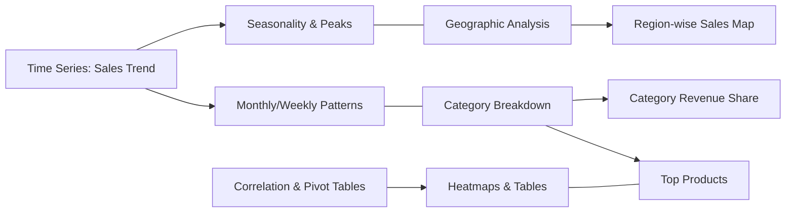

# Diwali Sales Data Analysis

## Project Overview
This project analyzes Diwali sales data to extract insights on sales trends, top products, category performance, and geographic distribution. The analysis is organized as a Jupyter Notebook (`Diwali_Sales_Data_analysis.ipynb`) containing data loading, cleaning, EDA, feature engineering, visualization, and summary sections.

## Dataset
- Expected format: CSV or Excel containing transaction-level sales data.
- Typical columns: `InvoiceNo`, `InvoiceDate`, `Product`, `Category`, `Sub-Category`, `Quantity`, `Price`, `Revenue`, `CustomerID`, `City`, `State`, `Country`.

## Analysis Summary
The notebook performs the following high-level steps:

1. Data loading and initial inspection
2. Exploratory Data Analysis (EDA): summary statistics, missing values, data types
3. Data cleaning: handle missing values, correct dtypes, remove duplicates
4. Aggregation and feature engineering: extract date parts, compute revenue, group by category/region/date
5. Visualizations: time series (sales trend), category breakdowns, top products, geographic maps, heatmaps and correlation analysis
6. Insights & recommendations: action points based on observed trends

## How to run
1. Install dependencies (suggested):

```bash
python -m venv .venv
.\.venv\Scripts\activate
pip install -r requirements.txt
```

2. Open and run the notebook with Jupyter:

```bash
jupyter notebook "Diwali_Sales_Data_analysis.ipynb"
```

## Notebook structure
- Section 1: Load data and overview
- Section 2: Cleaning & preprocessing
- Section 3: Exploratory data analysis (plots and tables)
- Section 4: Aggregations and feature engineering
- Section 5: Visualizations and insights
- Section 6: Conclusions and next steps

## Analysis flowchart
Use the following flowchart to understand the data-analysis pipeline:

```mermaid
graph TD
  A[Load Data (CSV/Excel)] --> B[Explore Data (EDA)]
  B --> C[Clean Data (missing, types, duplicates)]
  C --> D[Feature Engineering]
  D --> E[Analysis & Visualizations]
  E --> F[Insights & Summary]
  C --> G{Need Aggregation?}
  G -- Yes --> H[Aggregate by Category/Region/Date]
  H --> D
  G -- No --> D
```

## Key visual outputs
The notebook produces the following visualizations:



## Files
- Diwali_Sales_Data_analysis.ipynb — main analysis notebook
- README.md — this file

## Next steps & suggestions
- Execute the notebook to generate the plotted outputs and export key figures as PNGs.
- Add a `requirements.txt` listing packages used (pandas, numpy, matplotlib, seaborn, plotly, geopandas if maps are used).
- Save key figures into an `images/` folder and reference them from this README for a richer presentation.

---

If you want, I can now:
- run the notebook to produce the charts and save image files, or
- generate SVG/PNG versions of the flowchart diagrams and place them in an `images/` folder.

Which would you prefer next?
